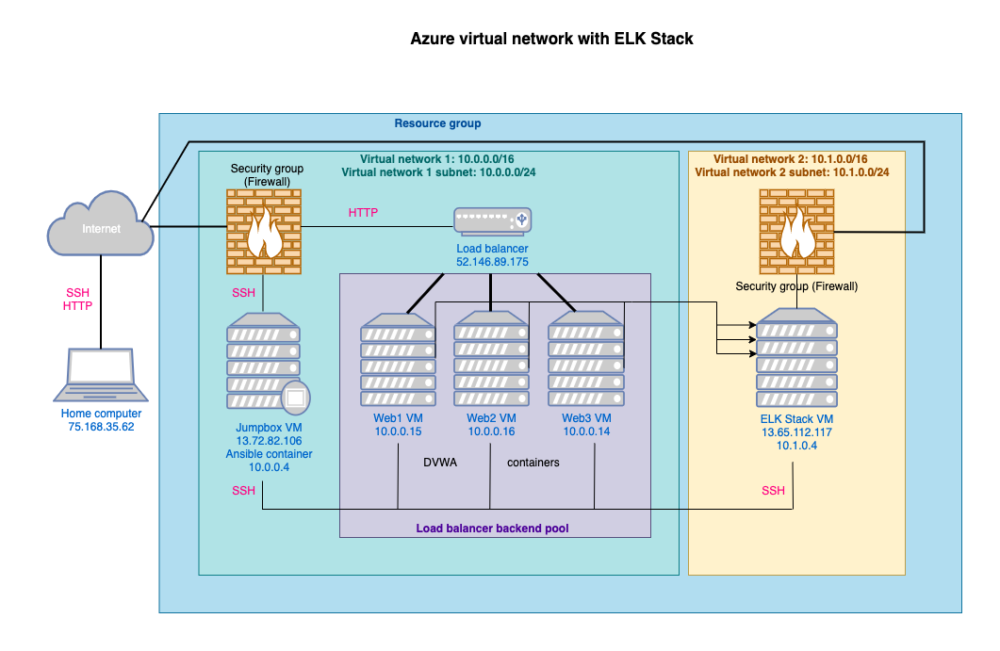
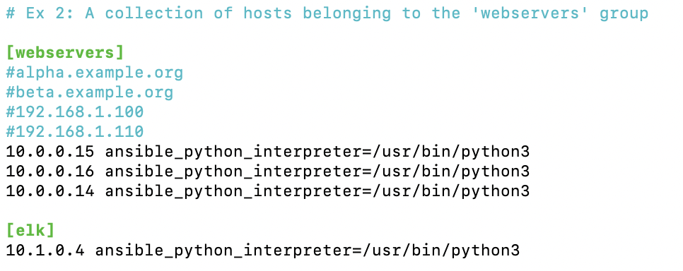
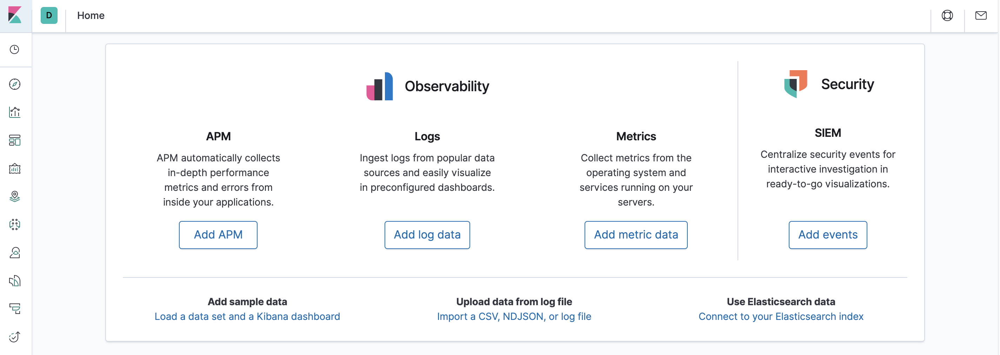

## Automated ELK Stack Deployment

The files in this repository were used to configure the network depicted below.

These files have been tested and used to generate a live ELK deployment on Azure. They can be used to recreate the entire deployment pictured above. Alternatively, select portions may be used to install only certain pieces of it, such as Filebeat.

  - 

This document contains the following details:
- Description of the Topology
- Access Policies
- ELK Configuration
  - Beats in Use
  - Machines Being Monitored
- How to Use the Ansible Build

### Description of the Topology

The main purpose of this network is to expose a load-balanced and monitored instance of DVWA, the D*mn Vulnerable Web Application.

Load balancing ensures the application will be highly stable and restricts access.
- This load balancer operates at layer 4 (transport layer) on the OSI model. It is designed to prevent any of the three Web# VMs from encountering too much traffic at once, lessening the risk of a distributed denial of service (DDoS) attack. It also protects the availability component of the CIA triad.

Integrating an ELK server allows users to easily monitor the vulnerable VMs for changes to the data and system logs. The ELK server receives data and system logs from each of the DVWAs and allows the user to analyze and visualize all the data in one place.
- Filebeat is used to collect log files events. Those events are then sent to Elasticsearch and/or Logstash. 

The configuration details of each machine may be found below.

| Name       | Function                | IP Address    | Operating System |
|------------|-------------------------|---------------|------------------|
| Jumpbox VM | Gateway                 | 13.72.82.106  | Linux            |
| Web1 VM    | Server                  | 10.0.0.15     | Linux            |
| Web2 VM    | Server                  | 10.0.0.16     | Linux            |
| Web3 VM    | Server                  | 10.0.0.14     | Linux            |
| ELK Stack  | Monitoring and analysis | 13.65.112.117 | Linux            |

### Access Policies

The machines on the internal network are not exposed to the public Internet. Only the Jumpbox VM can accept connections from the internet. Access to this machine is only allowed via SSH and HTTP from the following IP address:
- 75.168.35.62

Machines within the network can only be accessed by the Jumpbox VM ansible container and/or the load balancer.

Below is a summary of the access policies:

| Name          | Publicly Accessible? | Allowed IP Address(es)                     |
|---------------|----------------------|--------------------------------------------|
| Jumpbox VM    | Yes                  | 75.168.35.62                               |
| Web1 VM       | No                   | 10.0.0.4 52.146.89.175                     |
| Web2 VM       | No                   | 10.0.0.4 52.146.89.175                     |
| Web3 VM       | No                   | 10.0.0.4 52.146.89.175                     |
| Load balancer | Yes                  | 75.168.35.62                               |
| ELK Stack     | Yes                  | 10.0.0.15 10.0.0.16 10.0.0.14 75.168.35.62 |

### Elk Configuration

Ansible was used to automate configuration of the ELK machine. Configuration of the ELK machine was automated via an ansible container using an ansible playbook, saving time and allowing for greater consistency.

The playbook implements the following tasks:
- Install docker.io
- Install pip3
- Install Docker python module
- Download and launch a docker ELK container
- Enable service docker on boot

The following screenshot displays the result of running `docker ps` after successfully configuring the ELK instance. 

### Target Machines & Beats
This ELK server is configured to monitor the following machines:
| Name    | IP Address |
|---------|------------|
| Web1 VM | 10.0.0.15  |
| Web2 VM | 10.0.0.16  |
| Web3 VM | 10.0.0.14  |

The following beats have been installed on these machines:
- Filebeat

These Beats allow for the collection of the following information:
- Filebeat is used to collect log files from the 3 web VMs. It tracks events such as system logs, sudo command use, and SSH logins. This data is then displayed via Kibana.

### Using the Playbook
To use the playbook, an Ansible control node must be configured. Assuming you have such a control node provisioned: 

SSH into the control node and follow the steps below:
- Copy the install-elk.yml file to /etc/ansible/roles

**Note: You may need to manually create the roles directory in /etc/ansible/**

- Update the hosts file to include an [elk] group. Use the ELK server's internal IP address and include ansible_python_interpreter=/usr/bin/python3 after the IP address to force the use of Python 3 instead of Python 2.

**See an example host file**: 

- Run the playbook, and navigate to http://13.65.112.117:5601/app/kibana to check that the installation worked as expected. You should see a page similar to this: 